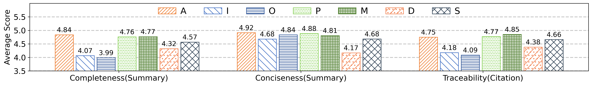
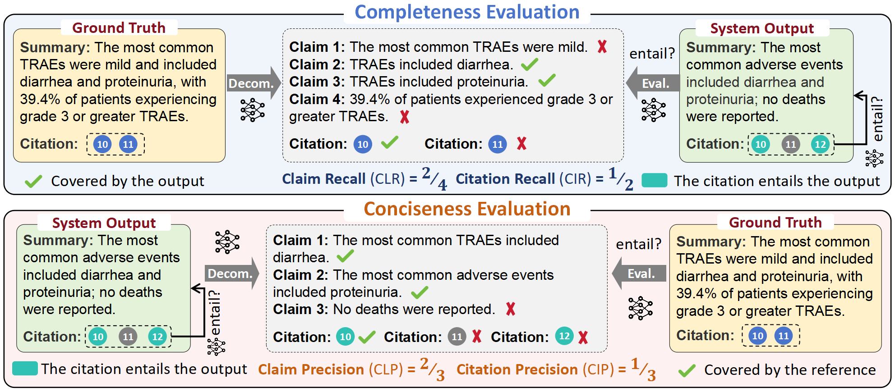

## TracSum: A New Benchmark for Aspect-Based Summarization with Sentence-Level Traceability in Medical Domain

[Introduction](#INTRODUCTION) | [Paper](#PAPER) | [Dataset](#DATASET) | [Baseline](#) | [Evaluation](#EVALUATION) | [Updates](#)

---

### INTRODUCTION
In this work, we introduce TracSum, a novel benchmark for traceable, aspect-based summarization, in which generated summaries are paired with sentence-level citations, enabling users to trace back to the original context. 

- We annotate 500 medical abstracts for seven key medical aspects, yielding 3.5K summary-citations pairs. 
  
- We propose a fine-grained evaluation framework for this new task, designed to assess the completeness and consistency of generated content using four metrics. 
  
- We introduce a summarization pipeline, Track-Then-Sum, which serves as a baseline method for comparison. 


### DATASET
Among the 500 abstracts, the average length is 319.89 tokens, with abstract lengths ranging from 25 to 1,104 tokens. Each abstract contains an average of 10.42 sentences, spanning from 1 to 32. In the dataset of 3.5K data instances, 2,862 are positive and 638 are negative. The positive summaries average 28.06 tokens in length, with a range from 3 to 77 tokens. On average, each positive summary cites 1.78 sentences, with a range from 1 to 7.



### EVALUATION
we propose a fine-grained evaluation framework for this new task by extending the methodology of [Xie et al. (2024)](#) and [Gao et al. (2023)](), which evaluate completeness and conciseness of generated content through a suite of metrics, as illustrated in [Figure](). Unlike their original definitions, our approach incorporates citation recall and precision to evaluate completeness and conciseness. Before computing these metrics, we first check whether the cited sentences entail the generated summary.




### PAPER
```
@inproceedings{
    anonymous2025tracsum,
    title={TracSum: A New Benchmark for Aspect-Based Summarization with Sentence-Level Traceability in Medical Domain},
    author={Anonymous},
    booktitle={Submitted to ACL Rolling Review - May 2025},
    year={2025},
    url={https://openreview.net/forum?id=2nXooha7E0},
    note={under review}
}
```