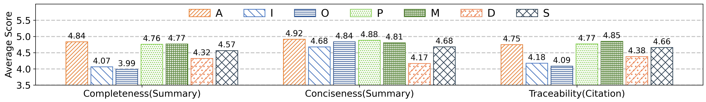
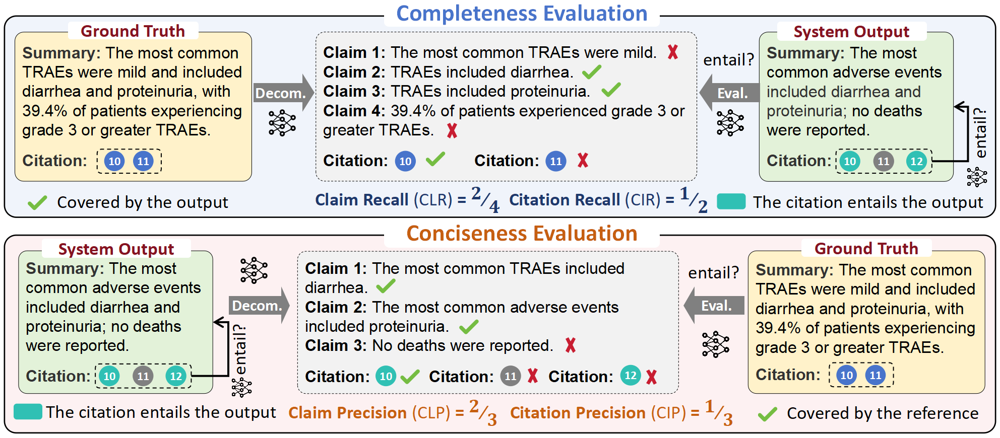

## TracSum: A New Benchmark for Aspect-Based Summarization with Sentence-Level Traceability in Medical Domain

[Introduction](#INTRODUCTION) | [Paper](#PAPER) | [Dataset](#DATASET) | [Baseline](#) | [Evaluation](#EVALUATION) | [Updates](#)

---

### INTRODUCTION
In this work, we introduce TracSum, a novel benchmark for traceable, aspect-based summarization, in which generated summaries are paired with sentence-level citations, enabling users to trace back to the original context. 

- We annotate 500 medical abstracts for seven key medical aspects, yielding 3.5K summary-citations pairs. 
  
- We propose a fine-grained evaluation framework for this new task, designed to assess the completeness and consistency of generated content using four metrics. 
  
- We introduce a summarization pipeline, Track-Then-Sum, which serves as a baseline method for comparison. 


### DATASET
Among the 500 abstracts, the average length is 319.89 tokens, with abstract lengths ranging from 25 to 1,104 tokens. Each abstract contains an average of 10.42 sentences, spanning from 1 to 32. In the dataset of 3.5K data instances, 2,862 are positive and 638 are negative. The positive summaries average 28.06 tokens in length, with a range from 3 to 77 tokens. On average, each positive summary cites 1.78 sentences, with a range from 1 to 7.



### EVALUATION
we propose a fine-grained evaluation framework for this new task by extending the methodology of [Xie et al. (2024)](#) and [Gao et al. (2023)](), which evaluate completeness and conciseness of generated content through a suite of metrics, as illustrated in [Figure](). Unlike their original definitions, our approach incorporates citation recall and precision to evaluate completeness and conciseness. Before computing these metrics, we first check whether the cited sentences entail the generated summary.




### PAPER
```
@inproceedings{chu-etal-2025-tracsum,
    title = "{T}rac{S}um: A New Benchmark for Aspect-Based Summarization with Sentence-Level Traceability in Medical Domain",
    author = "Chu, Bohao  and
      Li, Meijie  and
      Frihat, Sameh  and
      Gu, Chengyu  and
      Lodde, Georg  and
      Livingstone, Elisabeth  and
      Fuhr, Norbert",
    editor = "Christodoulopoulos, Christos  and
      Chakraborty, Tanmoy  and
      Rose, Carolyn  and
      Peng, Violet",
    booktitle = "Proceedings of the 2025 Conference on Empirical Methods in Natural Language Processing",
    month = nov,
    year = "2025",
    address = "Suzhou, China",
    publisher = "Association for Computational Linguistics",
    url = "https://aclanthology.org/2025.emnlp-main.43/",
    doi = "10.18653/v1/2025.emnlp-main.43",
    pages = "844--864",
    ISBN = "979-8-89176-332-6",
    abstract = "While document summarization with LLMs has enhanced access to textual information, concerns about the factual accuracy of these summaries persist (e.g., hallucination), especially in the medical domain. Tracing source evidence from which summaries are derived enables users to assess their accuracy, thereby alleviating this concern. In this paper, we introduce TracSum, a novel benchmark for traceable, aspect-based summarization, in which generated summaries are paired with sentence-level citations, enabling users to trace back to the original context. First, we annotate 500 medical abstracts for seven key medical aspects, yielding 3.5K summary-citations pairs. We then propose a fine-grained evaluation framework for this new task, designed to assess the completeness and consistency of generated content using four metrics. Finally, we introduce a summarization pipeline, Track-Then-Sum, which serves as a baseline method for comparison. In experiments, we evaluate both this baseline and a set of LLMs on TracSum, and conduct a human evaluation to assess the evaluation results. The findings demonstrate that TracSum can serve as an effective benchmark for traceable, aspect-based summarization tasks. We also observe that explicitly performing sentence-level tracking prior to summarization enhances generation accuracy, while incorporating the full context further improves summary completeness. Source code and dataset are available at https://github.com/chubohao/TracSum."
}
```
